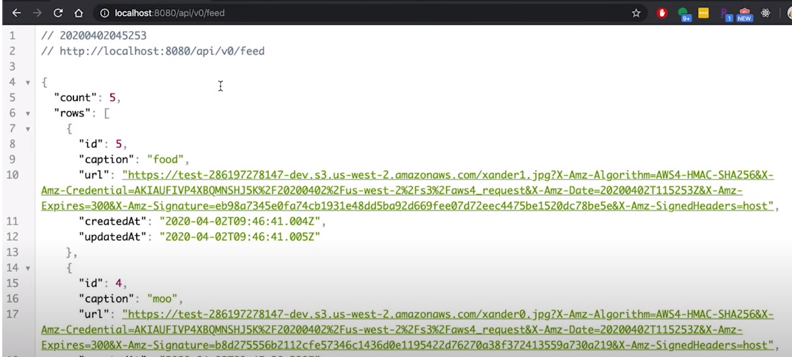
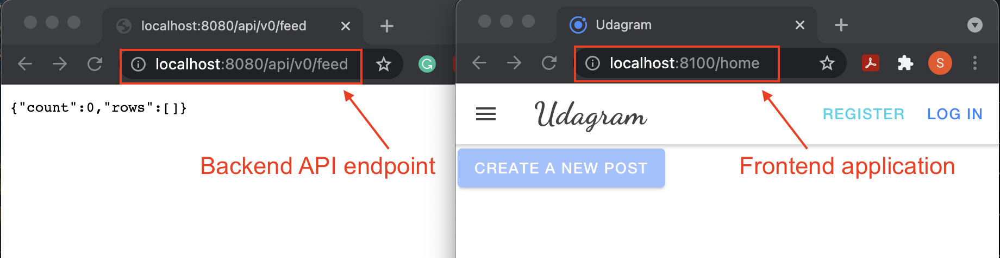
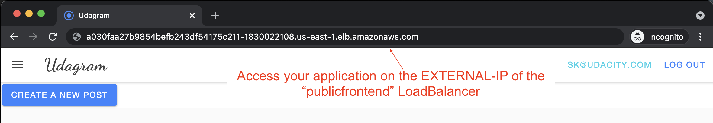
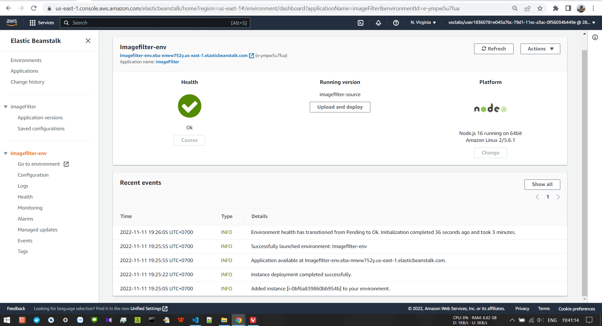

# Instagram Image Filtering Application Microservice

In this project I will:
- Refactor the monolith application to microservices
- Set up each microservice to be run in its own Docker container
- Set up a Travis CI pipeline to push images to DockerHub
- Deploy the DockerHub images to the Kubernetes cluster

Allows users to register and log into a web client, post photos to the feed, and process photos using an image filtering microservice.

The project is split into three parts:
1. The Simple Frontend, Angular web application built with Ionic Framework client web application which consumes the RestAPI Backend.
2. The RestAPI Backend, a Node-Express server which can be deployed to a cloud service.

## Environment Script
The `set_env.sh` has been prepared as an optional tool to help configure these variables on local environment. Do _not_ let credentials to be stored in git. After pulling this project, run the following command to tell git to stop tracking the script in git but keep it stored locally and add the file to our `.gitignore` file.
```bash
git rm --cached set_env.sh
echo *set_env.sh >> .gitignore
```

## 1. Database
Create a PostgreSQL database either locally or on AWS RDS.
* The port number will need to be set as `5432` (default).

Set the config values for environment variables prefixed with `POSTGRES_` in `set_env.sh`.
* If you set up a local database, your `POSTGRES_HOST` is most likely `localhost`
* If you set up an RDS database, your `POSTGRES_HOST` is most likely in the following format: `***.****.us-west-1.rds.amazonaws.com`.

## 2. S3
Create an AWS S3 bucket. The S3 bucket is used to store images that are displayed in Instagram fake. Set the config values for environment variables prefixed with `AWS_` in `set_env.sh`.

In newly-created S3 bucket, go to the **Permissions** tab and add an additional bucket policy to enable access for other AWS services (ie. Kubernetes). You can use the <a href="https://awspolicygen.s3.amazonaws.com/policygen.html" target="_blank">policy generator</a> tool to generate such an IAM policy. See an example below.
```json
{
    "Version":"2012-10-17",
    "Statement":[
        {
            "Sid":"Stmt1625306057759",
            "Principal":"*",
            "Action":"s3:*",
            "Effect":"Allow",
            "Resource":"arn:aws:s3:::test-nd9990-dev-wc"
        }
    ]
}
```
Add the CORS configuration to allow the application running outside of AWS to interact with your bucket. You can use the following configuration:
```json
[
    {
        "AllowedHeaders":["*"],
        "AllowedMethods":[
            "POST",
            "GET",
            "PUT",
            "DELETE",
            "HEAD"
        ],
        "AllowedOrigins":["*"],
        "ExposeHeaders":[]
    }
]
```

## 3. Backend API
Launch the backend API locally. The API is the application's interface to S3 and the database.
* Run the command from the directory `backend-monolith/`:
    ```bash
    npm install .
    npm run dev
    ```
* Visit `http://localhost:8080/api/v0/feed` in your web browser to verify that the application is running.

* Backend `/user/` service - allows users to register and log into a web client.
* Backend `/feed/` service - allows users to post photos, and process photos using image filtering. 
* Nginx as a reverse proxy server - for resolving multiple services running on the same port in separate containers. When different backend services are running on the same port, then a reverse proxy server directs client requests to the appropriate backend server and retrieves resources on behalf of the client.

## 4. Frontend App
Launch the frontend app locally. 
* Run the command from the directory `frontend/`:
    ```bash
    npm install .
    npm install -g ionic
    # compiling them into static files
    ionic build
    # run the application locally 
    ionic serve
    ```
* Visit `http://localhost:8100` in your web browser to verify that the application is running. 

## 5. *reverse-proxy*: containers discover each other and communicate
The *reverseproxy* service will help add another layer between the frontend and backend APIs so that the frontend only uses a single endpoint and doesn't realize it's deployed separately. *This is one of the approaches and not necessarily the only way to deploy the services. *To set up the *reverseproxy* container, follow the steps below:
1. Create a newer directory */reverse-proxy/  *
2. Create a Dockerfile.
3. Create the *nginx.conf* file that will associate all the service endpoints.


## 6. Use Docker compose to build and run multiple Docker containers
1. Create a `docker-compose-build.yaml` file. It will create an image for each individual service. Then, run the following command to create images locally:
    ```bash
    # Remove unused and dangling images
    docker image prune --all
    docker-compose -f docker-compose-build.yaml build --parallel
    ```
2. Create another YAML file `docker-compose.yaml`. It will use the existing images and create containers. While creating containers, it defines the port mapping, and the container dependency. Start the application using:
    ```bash
    docker-compose up
    ```
3. Visit http://localhost:8100 in your web browser to verify that the application is running.


## 7. Set up Travis continuous integration pipeline
Prior to setting up a multi-container application in Kubernetes, set up a CI pipeline to build and push our application code as Docker images in DockerHub. The end result that we want is a setup where changes in your GitHub code will automatically trigger a build process that generates Docker images.

### Create Dockerhub Repositories
Create 4 public repositories - each repository corresponding to your local Docker images.
* `reverse-proxy`
* `backend-api-user`
* `backend-api-feed`
* `frontend`

### Set up Travis CI Pipeline
Use Travis CI pipeline to build and push images to your DockerHub registry. 
1. Set up your Dockerhub username and password in the Travis repository's settings, so that they can be used inside of `.travis.yml` file while pushing images to the Dockerhub. 
2. Add a `.travis.yml` configuration file to the project directory locally.    

### Screenshots
So that we can verify your project’s pipeline is set up properly, please include the screenshots of the following:
1. DockerHub showing images that you have pushed
2. Travis CI showing a successful build job

## 8. Container Orchestration with Kubernetes
### EKS Cluster Creation
Follow the instructions provided by AWS on [Creating an Amazon EKS Cluster](https://docs.aws.amazon.com/eks/latest/userguide/create-cluster.html).

> For the _Cluster Service Role_ in the creation process, create an `AWS role` for EKS. Make sure you attach the policies for `AmazonEKSClusterPolicy`, `AmazonEC2ContainerServiceFullAccess`, and `AmazonEKSServicePolicy`.

### EKS Node Groups
Once your cluster is created, we will need to add Node Groups so that the cluster has EC2 instances to process the workloads.

Follow the instructions provided by AWS on [Creating a Managed Node Group](https://docs.aws.amazon.com/eks/latest/userguide/create-managed-node-group.html). Similar to before, make sure you're following the steps for _AWS Management Console_.

### Tips
* For the _Node IAM Role_ in the creation process, create an [AWS role](https://docs.aws.amazon.com/IAM/latest/UserGuide/id_roles.html) for EKS Node Groups. Make sure you attach the policies for `AmazonEKSWorkerNodePolicy`, `AmazonEC2ContainerRegistryReadOnly`, and `AmazonEKS_CNI_Policy`.
* Recommend using `m5.large` instance types
* Recommend setting 2 minimum nodes, 3 maximum nodes

### Connecting kubectl with EKS
* Follow the instructions provided by AWS on [Create a kubeconfig for Amazon EKS](https://docs.aws.amazon.com/eks/latest/userguide/create-kubeconfig.html). This will make it such that your `kubectl` will be running against your newly-created EKS cluster.

### Verify Cluster and Connection
* Once `kubectl` is configured to communicate with your EKS cluster, run the following to validate that it's working:
    ```bash
    kubectl get nodes
    ```

### Deployment
Deploy the Docker containers for the frontend & backend in their respective pods. 
1. **ConfigMap:** Create `env-configmap.yaml`, and save all your configuration values (non-confidential environments variables) in that file. 
2. **Secret:** Create `env-secret.yaml` file to store the confidential values, such as login credentials. Unlike the AWS credentials, these values do not need to be Base64 encoded.
3. **Secret:** Create `aws-secret.yaml` file to store your AWS login credentials. Replace `___INSERT_AWS_CREDENTIALS_FILE__BASE64____` with the Base64 encoded credentials. 
    * Mac/Linux users: You need to select the applicable pair of `aws_access_key` from the output of the `cat` command above and convert that string into `base64`:
        ```bash
        # Use a combination of head/tail command to identify lines you want to convert to base64
        # we just need two correct lines: a right pair of aws_access_key_id and aws_secret_access_key
        cat ~/.aws/credentials | tail -n 5 | head -n 2
        cat ~/.aws/credentials | tail -n 5 | head -n 2 | base64
        ```
     * **Windows users:** Copy a pair of *aws_access_key* from the AWS credential file and paste it into the encoding field of this third-party website: https://www.base64encode.org/ (or any other). Encode and copy/paste the result back into the *aws-secret.yaml*  file.

<br>

4. **Deployment configuration:** Create `deployment.yaml` file individually for each service. While defining container specs, make sure to specify the same images you've pushed to the Dockerhub earlier. Ultimately, the frontend web application and backend API applications should run in their respective pods.

5. **Service configuration:** Similarly, create the *service.yaml* file thereby defining the right services/ports mapping.

Once, all deployment and service files are ready, you can use commands like:
```bash
# Apply env variables and secrets
kubectl apply -f aws-secret.yaml
kubectl apply -f env-secret.yaml
kubectl apply -f env-configmap.yaml
# Deployments - Double check the Dockerhub image name and version in the deployment files
kubectl apply -f backend-api-feed-deployment.yaml
# Do the same for other three deployment files
# Service
kubectl apply -f backend-api-feed-service.yaml
# Do the same for other three service files
```

### Connecting k8s services to access the application
If the deployment is successful, and services are created, there are two options to access the application:
1. **Port Forwarding:** If you deployed the services as CLUSTERIP, then you will have to [forward a local port to a port on the "frontend" Pod](https://kubernetes.io/docs/tasks/access-application-cluster/port-forward-access-application-cluster/#forward-a-local-port-to-a-port-on-the-pod). In this case, you don't need to change the URL variable locally.

2. **Expose External IP:** If you exposed the "frontend" deployment using a Load Balancer's External IP, then you'll have to update the URL environment variable locally, and re-deploy the images with updated env variables. Use this link to <a href="https://kubernetes.io/docs/tutorials/stateless-application/expose-external-ip-address/" target="_blank">expose an External IP</a> address to access your application in the EKS Cluster.
    ```bash
    # Check the deployment names and their pod status
    kubectl get deployments
    # Create a Service object that exposes the frontend deployment:
    kubectl expose deployment frontend --type=LoadBalancer --name=publicfrontend
    kubectl get services publicfrontend
    # Note down the External IP, such as 
    # a5e34958a2ca14b91b020d8aeba87fbb-1366498583.us-east-1.elb.amazonaws.com
    # Check name, ClusterIP, and External IP of all deployments
    kubectl get services 
    ```
    
    

### Update the environment variables and Re-Deploy the Application
Once you have the External IP of your front end and reverseproxy deployment, Change the API endpoints in the following places locally:
* Environment variables - Replace the http://**localhost**:8100 string with the Cluster-IP of the `frontend` service.  After replacing run `source ~/.zshrc` and verify using `echo $URL`
*  `Secret_Deploy/env-configmap.yaml` file - Replace http://localhost:8100 string with the Cluster IP of the `frontend`. 
* `frontend/src/environments/environment.ts` file - Replace the keyword localhost in the http://localhost:8080/api/v0 string with the External-IP of the reverseproxy deployment. For example,
    ```bash
    # Assuming http://513419455.us-east-1.elb.amazonaws.com is the External-IP of the *reverseproxy* service.
    apiHost: 'http://513419455.us-east-1.elb.amazonaws.com:8080/api/v0'
    ```
    Here, we are using the External-IP to connect the frontend to the reverse-proxy.

*  Update `frontend/src/environments/environment.prod.ts` - file in the same way as done for the environment.ts file.
* Retag in the `.travis.yaml` (say use v3, v4, v5, ...) as well as deployment YAML files

Then, push your changes to the Github repo. Travis will automatically build and re-push images to your Dockerhub. 

Build a new frontend image, and push it to the Dockerhub. While building a new image, it is recommended to use a different tag each time, as shown in the example below:
```bash
# Run these commands from the /frontend directory
docker build . -t [Dockerhub-username]/frontend:v6
docker push [Dockerhub-username]/frontend:v6
```
Next, re-apply configmap and re-deploy to the k8s cluster.
```bash
kubectl apply -f env-configmap.yaml
# Rolling update "frontend" containers of "frontend" deployment, updating the image
kubectl set image deployment frontend frontend=phanhoaithu/frontend:v2
# Do the same for other three deployments
```
Check your deployed application at the External IP of your *publicfrontend* service. 


### Troubleshoot
1. Use this command to see the STATUS of your pods:
    ```bash
    kubectl get pods
    kubectl describe pod <pod-id>
    # An example:
    # kubectl logs backend-user-5667798847-knvqz
    # Error from server (BadRequest): container "backend-user" in pod "backend-user-5667798847-knvqz" is waiting to start: trying and failing to pull image
    ```
    In case of `ImagePullBackOff` or `ErrImagePull` or `CrashLoopBackOff`, review your deployment.yaml file(s) if they have the right image path. 

2. Look at what's there inside the running container. [Open a Shell to a running container](https://kubernetes.io/docs/tasks/debug-application-cluster/get-shell-running-container/) as:
    ```bash
    kubectl get pods
    # Assuming "backend-feed-68d5c9fdd6-dkg8c" is a pod
    kubectl exec --stdin --tty backend-feed-68d5c9fdd6-dkg8c -- /bin/bash
    # See what values are set for environment variables in the container
    printenv | grep POST
    # Or, you can try "curl <cluster-IP-of-backend>:8080/api/v0/feed " to check if services are running.
    # This is helpful to see is backend is working by opening a bash into the frontend container
    ```

3. When you are sure that all pods are running successfully, then use developer tools in the browser to see the precise reason for the error. 
    * If your frontend is loading properly, and showing `Error: Uncaught (in promise): HttpErrorResponse: {"headers":{"normalizedNames":{},"lazyUpdate":null,"headers":{}},"status":0,"statusText":"Unknown Error"....`, it is possibly because the `frontend/src/environments/environment.ts` file has incorrectly defined the ‘apiHost’ to whom forward the requests. 
    * If your frontend is **not** not loading, and showing `Error: Uncaught (in promise): HttpErrorResponse: {"headers":{"normalizedNames":{},"lazyUpdate":null,"headers":{}},"status":0,"statusText":"Unknown Error", ....` , it is possibly because URL variable is not set correctly. 
    * In the case of `Failed to load resource: net::ERR_CONNECTION_REFUSED` error as well, it is possibly because the URL variable is not set correctly.

### Screenshots
So that we can verify that your project is deployed, please include the screenshots of the following commands with your completed project. 
```bash
# Kubernetes pods are deployed properly
kubectl get pods 
# Kubernetes services are set up properly
kubectl describe services
# You have horizontal scaling set against CPU usage
kubectl describe hpa
```

## 9. Logging  
Use logs to capture metrics.  This can help us with debugging.

### Screenshots
To verify that user activity is logged, please include a screenshot of:
```bash
kubectl logs <your pod name>
```

## Tips
1. It's useful to "lint" your code so that changes in the codebase adhere to a coding standard:
    ```bash
    npx eslint --ext .js,.ts src/
    # To have your code fixed automatically, run
    npx eslint --ext .js,.ts src/ --fix
    ```
2. Over time, our code will become outdated and inevitably run into security vulnerabilities. To address them, you can run:
    ```bash
    npm audit fix
    ```
3. `set_env.sh` is really for your backend application. Frontend applications have a different notion of how to store configurations. Configurations for the application endpoints can be configured inside of the `environments/environment.*ts` files.
4. In `set_env.sh`, environment variables are set with `export $VAR=value`. Setting it this way is not permanent; every time you open a new terminal, you will have to run `set_env.sh` to reconfigure your environment variables. To set the environment variables permanently, save all the variables above in your `~/.bashrc` or `~/.profile` or `~/.zshrc` file and use:
    ```bash
    source ~/.profile
    ```

## Image Filter App JS Deploy to ElasticBeanstalk
1. Screenshot of EB app after deployement


2. URL running in EB: [image-filter](http://imagefilter-env.eba-nnww752y.us-east-1.elasticbeanstalk.com/filteredimage?image_url=https://www.seiu1000.org/sites/main/files/main-images/camera_lense_0.jpeg)


## Submission Requirements
The project will be submitted as a link to a GitHub repo or a zip file and should include screenshots to document the application's infrastructure.

### Required Screenshots
* Docker images in your repository in DockerHub
* TravisCI build pipeline showing successful build jobs
* Kubernetes `kubectl get pods` output
* Kubernetes `kubectl describe services` output
* Kubernetes `kubectl describe hpa` output  
* Kubernetes `kubectl logs <your pod name>` output 